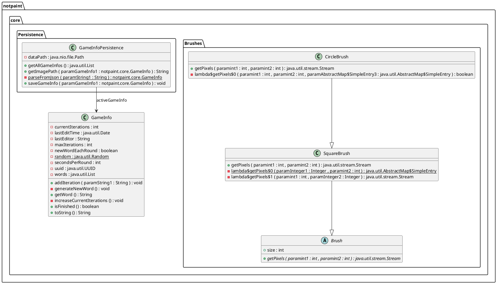

# Klassediagram

For å generere eller oppdatere de eksisterende klassediagrammene, kjør:
`mvn generate-test-sources`

Dette vil generere PlantUML-diagram i hver modul sin `target/generated-docs` mappe

## notpaint.core

## notpaint.ui

```plantuml
@startuml

class notpaint.ui.App {
	{field} {static} ~scene : javafx.scene.Scene
	{method}  {static} -loadFXML ( paramString1 : String ) : javafx.scene.Parent
	{method}  {static} +main ( paramString;1 : [Ljava.lang.String; ) : void
	{method}  {static} ~setRoot ( paramString1 : String ) : void
	{method} +start ( paramStage1 : javafx.stage.Stage ) : void
}


class notpaint.ui.GameSelectController {
	{field} -activeProjectsScrollPane : javafx.scene.control.ScrollPane
	{field} -activeTilePane : javafx.scene.layout.TilePane
	{field} -completedProjectsScrollPane : javafx.scene.control.ScrollPane
	{field} -completedTilePane : javafx.scene.layout.TilePane
	{field} -gameInfoPersistence : notpaint.core.Persistence.GameInfoPersistence
	{field} -iterations : javafx.scene.text.Text
	{field} -lastEdit : javafx.scene.text.Text
	{field} -lastEditor : javafx.scene.text.Text
	{field} -secondsPerRound : javafx.scene.text.Text
	{field} -selectedGameInfo : notpaint.core.GameInfo
	{method} ~addImage ( paramGameInfo1 : notpaint.core.GameInfo ) : void
	{method} +addImageToActiveTap ( paramGameInfo1 : notpaint.core.GameInfo ) : void
	{method} -addImageToTab ( paramGameInfo1 : notpaint.core.GameInfo , paramTilePane2 : javafx.scene.layout.TilePane ) : void
	{method} -displayGameInfos ( paramList1 : java.util.List ) : void
	{method} -handleJoinProject () : void
	{method} -handleNewProject () : void
	{method} -initialize () : void
	{method} -lambda$addImageToTab$0 ( paramGameInfo1 : notpaint.core.GameInfo , paramMouseEvent2 : javafx.scene.input.MouseEvent ) : void
	{method} -lambda$initialize$1 ( paramObservableValue1 : javafx.beans.value.ObservableValue , paramWindow2 : javafx.stage.Window , paramWindow3 : javafx.stage.Window ) : void
	{method} -lambda$initialize$2 ( paramObservableValue1 : javafx.beans.value.ObservableValue , paramScene2 : javafx.scene.Scene , paramScene3 : javafx.scene.Scene ) : void
	{method} -onGameInfoPersistenceLoaded () : void
	{method} -onStageLoaded ( paramStage1 : javafx.stage.Stage ) : void
}


class notpaint.ui.GameSelectController$1 {
	{method} +compare ( paramObject1 : Object , paramObject2 : Object ) : int
	{method} +compare ( paramGameInfo1 : notpaint.core.GameInfo , paramGameInfo2 : notpaint.core.GameInfo ) : int
}


class notpaint.ui.PaintController {
	{field} -chooser : javafx.stage.FileChooser
	{field} ~circleBig : javafx.scene.shape.Circle
	{field} ~circleMedium : javafx.scene.shape.Circle
	{field} ~circleSmall : javafx.scene.shape.Circle
	{field} ~colorPicker : javafx.scene.control.ColorPicker
	{field} ~countDown : javafx.scene.text.Text
	{field} -countDownSecondsLeft : Integer
	{field} -countDownTimer : java.util.Timer
	{field} ~drawingCanvas : javafx.scene.canvas.Canvas
	{field} -gameInfo : notpaint.core.GameInfo
	{field} -gameInfoPersistence : notpaint.core.Persistence.GameInfoPersistence
	{field} ~squareBig : javafx.scene.shape.Rectangle
	{field} ~squareMedium : javafx.scene.shape.Rectangle
	{field} ~squareSmall : javafx.scene.shape.Rectangle
	{field} ~wordToDrawText : javafx.scene.text.Text
	{method} -finishDrawing () : void
	{method} -handleCavasClick ( paramMouseEvent1 : javafx.scene.input.MouseEvent ) : void
	{method} +initialize () : void
	{method} -lambda$initialize$0 ( paramMouseEvent1 : javafx.scene.input.MouseEvent ) : void
	{method} -lambda$initialize$1 ( paramMouseEvent1 : javafx.scene.input.MouseEvent ) : void
	{method} -lambda$initialize$2 ( paramMouseEvent1 : javafx.scene.input.MouseEvent ) : void
	{method} -lambda$initialize$3 ( paramMouseEvent1 : javafx.scene.input.MouseEvent ) : void
	{method} -lambda$initialize$4 ( paramMouseEvent1 : javafx.scene.input.MouseEvent ) : void
	{method} -lambda$initialize$5 ( paramMouseEvent1 : javafx.scene.input.MouseEvent ) : void
	{method} -lambda$loadGameInfo$6 ( paramObservableValue1 : javafx.beans.value.ObservableValue , paramWindow2 : javafx.stage.Window , paramWindow3 : javafx.stage.Window ) : void
	{method} -lambda$loadGameInfo$7 ( paramObservableValue1 : javafx.beans.value.ObservableValue , paramScene2 : javafx.scene.Scene , paramScene3 : javafx.scene.Scene ) : void
	{method} -loadGameInfo () : void
	{method} -loadImage ( paramString1 : String ) : void
	{method} -onStageLoaded ( paramStage1 : javafx.stage.Stage ) : void
	{method} -resetCanvas () : void
	{method} ~saveImageToPath ( paramString1 : String ) : void
	{method} -setCircleBrush ( paramint1 : int ) : void
	{method} -setSquareBrush ( paramint1 : int ) : void
	{method} -setToolEraser () : void
	{method} -setToolPen () : void
	{method} -switchToSecondary () : void
	{method} -updatePaintColor () : void
}


class notpaint.ui.PaintController$1 {
	{method} +run () : void
}


class notpaint.ui.PaintController$1$1 {
	{method} +run () : void
}


class notpaint.ui.PaintSettings {
	{field} +brush : notpaint.core.Brushes.Brush
	{field} +color : javafx.scene.paint.Color
}


class notpaint.ui.PaintTools.EraserTool {
	{method} #getColor () : javafx.scene.paint.Color
}


class notpaint.ui.PaintTools.PenTool {
	{method} #getColor () : javafx.scene.paint.Color
	{method} -lambda$paint$0 ( paramPixelWriter1 : javafx.scene.image.PixelWriter , paramAbstractMap$SimpleEntry2 : java.util.AbstractMap$SimpleEntry ) : void
	{method} +paint ( paramCanvas1 : javafx.scene.canvas.Canvas , paramint2 : int , paramint3 : int ) : void
}


abstract class notpaint.ui.PaintTools.Tool {
	{method}  {abstract} +paint ( paramCanvas1 : javafx.scene.canvas.Canvas , paramint2 : int , paramint3 : int ) : void
}


abstract class notpaint.ui.Persistence.ImagePersistence {
	{method} +load ( paramString1 : String ) : javafx.scene.image.Image
	{method}  {abstract} +save ( paramImage1 : javafx.scene.image.Image , paramString2 : String ) : void
}


class notpaint.ui.Persistence.LocalImagePersistence {
	{method} -javaFXImageToBufferedImage ( paramImage1 : javafx.scene.image.Image ) : java.awt.image.BufferedImage
	{method} +save ( paramImage1 : javafx.scene.image.Image , paramString2 : String ) : void
}


class notpaint.ui.SettingsViewController {
	{field} ~checkboxNo : javafx.scene.control.RadioButton
	{field} ~checkboxYes : javafx.scene.control.RadioButton
	{field} ~maxIterationsTextField : javafx.scene.control.TextField
	{field} ~newWordToggleGroup : javafx.scene.control.ToggleGroup
	{field} ~setTimeTextField : javafx.scene.control.TextField
	{method} -createGame ( paramActionEvent1 : javafx.event.ActionEvent ) : void
	{method} +initialize () : void
	{method}  {static} -lambda$initialize$0 ( paramTextFormatter$Change1 : javafx.scene.control.TextFormatter$Change ) : javafx.scene.control.TextFormatter$Change
	{method} -switchToMenu () : void
}


class notpaint.ui.Util.AlertUtil {
	{method}  {static} +errorAlert ( paramString1 : String , paramString2 : String ) : void
	{method}  {static} +warningAlert ( paramString1 : String , paramString2 : String ) : void
}




notpaint.ui.GameSelectController$1 -->  notpaint.ui.GameSelectController : this$0
notpaint.ui.PaintController -->  notpaint.ui.PaintSettings : settings
notpaint.ui.PaintController -->  notpaint.ui.PaintTools.Tool : selectedTool
notpaint.ui.PaintController -->  notpaint.ui.Persistence.ImagePersistence : imagePersistence
notpaint.ui.PaintController$1 -->  notpaint.ui.PaintController : this$0
notpaint.ui.PaintController$1$1 -->  notpaint.ui.PaintController$1 : this$1
notpaint.ui.PaintTools.EraserTool --|>  notpaint.ui.PaintTools.PenTool
notpaint.ui.PaintTools.PenTool --|>  notpaint.ui.PaintTools.Tool
notpaint.ui.PaintTools.Tool -->  notpaint.ui.PaintSettings : settings
notpaint.ui.Persistence.LocalImagePersistence --|>  notpaint.ui.Persistence.ImagePersistence


@enduml
```
