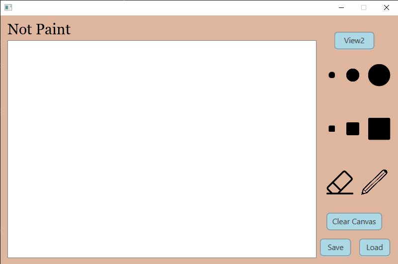

# NotPaint
Dette prosjektet er en tegneapp som skal gjøre det mulig for brukere å tegne på et lerret, og så kunne lagre/hente bildene fra en ekstern server. Bruker skal kunne velge størrelse på pensel, form og farge, og ha muligheten til å viske vekk tegningen. Det er planlagt at man skal kunne være flere som tegner på lerretet samtidig. 

Dersom det blir en for stor utfordring å få til at flere personer kan tegne samtidig, er plan B å dreie prosjektet mot et spill. Bruker får et randomisert ord som de skal tegne, og de resterende spillerne skal gjette først hvilket ord som tegnes. 

## Bilde av grensesnittet

Dette er det foreløpige grensesnittet. Videre skal flere funksjonsknapper legges til, som farger og fill-in.
- Sirklene setter pensel til indikert radius
- Firkantene setter pensel til indikert
størrelse
- Viskelæret setter pensel til hvit, slik at tegnede områder kan viskes ut
- Blyanten setter pensel til farge (foreløpigt svart)
- Clear canvas skal resette lerretet.
- Load-knappen skal hente opp fillager
- Save skal åpne lageret, så nåværende tegning kan lagres
- View2 er en placeholder for når vi etterhvert skal style fillageret i et sekundært view.

## Klassediagram

Vi bruker [PlantUML Generator](https://mvnrepository.com/artifact/de.elnarion.maven/plantuml-generator-maven-plugin) for å generere klassediagram.

For å generere eller oppdatere de eksisterende klassediagrammene, kjør:
`mvn generate-test-sources`

Dette vil generere PlantUML-diagram i hver modul sin `target/generated-docs` mappe

## Brukerhistorie (US-1)

Som bruker ønsker jeg å kunne tegne på et lerret og lagre tegningen lokalt.

Brukeren skal kunne tegne med forskjellige farger, samt størrelse og form på pensel. Det som har blitt tegnet skal også kunne viskes ut med et innebygd viskelær. Til slutt, når tegningen er ferdigstilt, skal bruker kunne lagre den, slik at de senere kan fortsette der de slapp og tegne videre.

Viktig å kunne se:
- Et lerret
- Valg av størrelse på pensel
- Valg av form på pensel
- Valg av farge
- Viskelær

Viktig å kunne gjøre:
- Velge pensel og male på lerretet med valgt farge
- Kunne viske ut det man har malt
- Kunne lagre tegningen til senere bruk