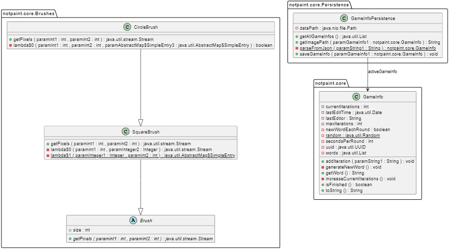

# Core

Modulen core inneholder kode for lagring, lasting, og opprettelse av nye spill.

Hvert spill lagres til en egen JSON-fil, som har en tilsvarende bildefil med samme navn, bortsett fra .png som filendelse.

## Klassediagram

